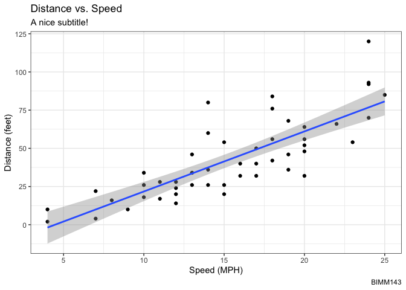
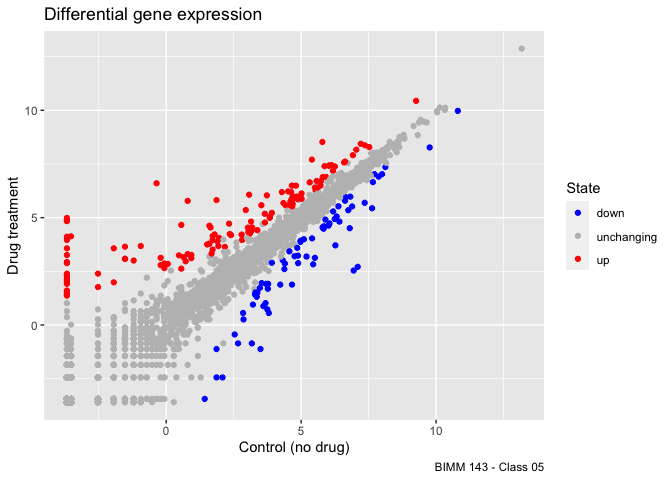

Class 05: Data Visualization with GGPLOT
================
Marcos Díaz-Gay
4/19/23

# Base R plotting

We are going to start by generating the plot of class 04. This code is
plotting the **cars** `dataset`.

``` r
plot(cars)
```


# Ggplot2

First, we need to install the package. We do this by using the
`install.packages` command.

``` r
# install.packages('ggplot2')
```

After that, we need to load the package.

``` r
library(ggplot2)
```

We are going to build the plot of the cars dataframe by using ggplot2.

``` r
ggplot(data = cars)
```


``` r
ggplot(data = cars) +
    aes(x=speed, y=dist)
```


``` r
ggplot(data = cars) +
    aes(x=speed, y=dist) + 
    geom_point()
```


``` r
ggplot(data = cars) +
    aes(x=speed, y=dist) + 
    geom_point() +
    geom_smooth(method = 'lm') +
    labs(title = 'Distance vs. Speed',
         subtitle = 'A nice subtitle!',
         caption = 'BIMM143',
         x = 'Speed (MPH)',
         y = 'Distance (feet)') +
    theme_bw()
```

    `geom_smooth()` using formula = 'y ~ x'



**Q1.** For which phases is data visualization important in our
scientific workflows? 

For Exploratory data analysis, detection of outliers, etc.

# Plotting gene expression data

Loading the data from the URL.

``` r
# Load data
url <- "https://bioboot.github.io/bimm143_S20/class-material/up_down_expression.txt"
genes <- read.delim(url)
head(genes)
```

            Gene Condition1 Condition2      State
    1      A4GNT -3.6808610 -3.4401355 unchanging
    2       AAAS  4.5479580  4.3864126 unchanging
    3      AASDH  3.7190695  3.4787276 unchanging
    4       AATF  5.0784720  5.0151916 unchanging
    5       AATK  0.4711421  0.5598642 unchanging
    6 AB015752.4 -3.6808610 -3.5921390 unchanging

Initial ggplot

``` r
ggplot(data = genes) +
    aes(x=Condition1, y=Condition2) +
    geom_point()
```


Q3

``` r
nrow(genes)
```

    [1] 5196

``` r
ncol(genes)
```

    [1] 4

``` r
colnames(genes)
```

    [1] "Gene"       "Condition1" "Condition2" "State"     

``` r
table(genes[,'State'])
```


          down unchanging         up 
            72       4997        127 

Adding color to the plot.

``` r
p1 <- ggplot(data = genes) +
    aes(x=Condition1, y=Condition2, col=State) +
    geom_point()
p1
```


Let’s change the color scheme.

``` r
p2 = p1 +
    scale_color_manual(values = c("blue", "gray", "red")) 
p2
```


Let’s add some labels

``` r
p2 + labs(title = 'Differential gene expression',
          x = 'Control (no drug)',
          y = 'Drug treatment',
          caption = 'BIMM 143 - Class 05')
```


