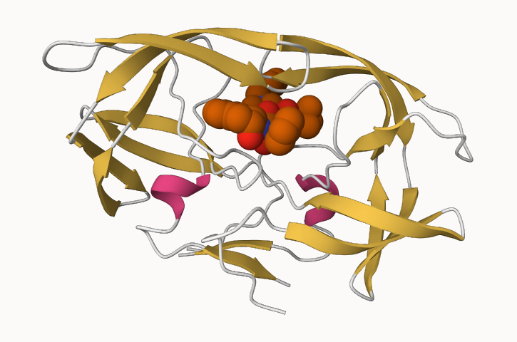

Class 9
================
Marcos

To read the file we are going to use the command `read.csv`.

``` r
pdb_stats <- read.csv('Data Export Summary.csv',
                      row.names = 1)
```

I need to sum all the elements of the X.ray column.

``` r
pdb_stats$X.ray
```

    [1] "154,766" "9,083"   "8,110"   "2,664"   "163"     "11"     

We are gonna use `gsub` to remove the commas

``` r
as.numeric( gsub(',', '', pdb_stats$X.ray) )
```

    [1] 154766   9083   8110   2664    163     11

I use the `sum` command to get the sum

``` r
n_xray <- sum( as.numeric( gsub(',', '', pdb_stats$X.ray) ) )
n_em <- sum( as.numeric( gsub(',', '', pdb_stats$EM) ) )
n_total <- sum( as.numeric( gsub(',', '', pdb_stats$Total) ) )
```

**Q1:** What percentage of structures in the PDB are solved by X-Ray and
Electron Microscopy.

``` r
p_xray <- (n_xray) / n_total
p_em <- (n_em) / n_total
p_xray
```

    [1] 0.8553721

``` r
p_em
```

    [1] 0.07455763

``` r
p_total <- p_xray + p_em
p_total
```

    [1] 0.9299297

- **Q2:** What proportion of structures in the PDB are protein?\\

``` r
total_protein <- as.numeric( gsub(',', '', pdb_stats[1, 7]) )
```

Proportion

``` r
total_protein / n_total
```

    [1] 0.8681246

# 2. Visualizing the HIV-1 protease structure



# 3. Introduction to Bio3D in R

``` r
library(bio3d)

pdb <- read.pdb("1hsg")
```

      Note: Accessing on-line PDB file

``` r
pdb
```


     Call:  read.pdb(file = "1hsg")

       Total Models#: 1
         Total Atoms#: 1686,  XYZs#: 5058  Chains#: 2  (values: A B)

         Protein Atoms#: 1514  (residues/Calpha atoms#: 198)
         Nucleic acid Atoms#: 0  (residues/phosphate atoms#: 0)

         Non-protein/nucleic Atoms#: 172  (residues: 128)
         Non-protein/nucleic resid values: [ HOH (127), MK1 (1) ]

       Protein sequence:
          PQITLWQRPLVTIKIGGQLKEALLDTGADDTVLEEMSLPGRWKPKMIGGIGGFIKVRQYD
          QILIEICGHKAIGTVLVGPTPVNIIGRNLLTQIGCTLNFPQITLWQRPLVTIKIGGQLKE
          ALLDTGADDTVLEEMSLPGRWKPKMIGGIGGFIKVRQYDQILIEICGHKAIGTVLVGPTP
          VNIIGRNLLTQIGCTLNF

    + attr: atom, xyz, seqres, helix, sheet,
            calpha, remark, call

``` r
attributes(pdb)
```

    $names
    [1] "atom"   "xyz"    "seqres" "helix"  "sheet"  "calpha" "remark" "call"  

    $class
    [1] "pdb" "sse"

``` r
head(pdb$atom)
```

      type eleno elety  alt resid chain resno insert      x      y     z o     b
    1 ATOM     1     N <NA>   PRO     A     1   <NA> 29.361 39.686 5.862 1 38.10
    2 ATOM     2    CA <NA>   PRO     A     1   <NA> 30.307 38.663 5.319 1 40.62
    3 ATOM     3     C <NA>   PRO     A     1   <NA> 29.760 38.071 4.022 1 42.64
    4 ATOM     4     O <NA>   PRO     A     1   <NA> 28.600 38.302 3.676 1 43.40
    5 ATOM     5    CB <NA>   PRO     A     1   <NA> 30.508 37.541 6.342 1 37.87
    6 ATOM     6    CG <NA>   PRO     A     1   <NA> 29.296 37.591 7.162 1 38.40
      segid elesy charge
    1  <NA>     N   <NA>
    2  <NA>     C   <NA>
    3  <NA>     C   <NA>
    4  <NA>     O   <NA>
    5  <NA>     C   <NA>
    6  <NA>     C   <NA>

## Predicting functional motions of a single structure by NMA

``` r
adk <- read.pdb('6s36')
```

      Note: Accessing on-line PDB file
       PDB has ALT records, taking A only, rm.alt=TRUE

``` r
adk
```


     Call:  read.pdb(file = "6s36")

       Total Models#: 1
         Total Atoms#: 1898,  XYZs#: 5694  Chains#: 1  (values: A)

         Protein Atoms#: 1654  (residues/Calpha atoms#: 214)
         Nucleic acid Atoms#: 0  (residues/phosphate atoms#: 0)

         Non-protein/nucleic Atoms#: 244  (residues: 244)
         Non-protein/nucleic resid values: [ CL (3), HOH (238), MG (2), NA (1) ]

       Protein sequence:
          MRIILLGAPGAGKGTQAQFIMEKYGIPQISTGDMLRAAVKSGSELGKQAKDIMDAGKLVT
          DELVIALVKERIAQEDCRNGFLLDGFPRTIPQADAMKEAGINVDYVLEFDVPDELIVDKI
          VGRRVHAPSGRVYHVKFNPPKVEGKDDVTGEELTTRKDDQEETVRKRLVEYHQMTAPLIG
          YYSKEAEAGNTKYAKVDGTKPVAEVRADLEKILG

    + attr: atom, xyz, seqres, helix, sheet,
            calpha, remark, call

``` r
m <- nma(adk)
```

     Building Hessian...        Done in 0.03 seconds.
     Diagonalizing Hessian...   Done in 0.796 seconds.

``` r
plot(m)
```


``` r
mktrj(m, file = "adk_m7.pdb")
```
