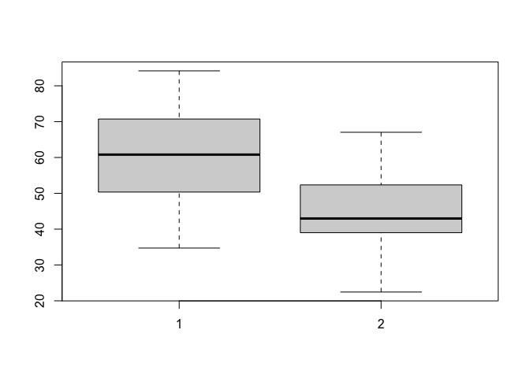

Class 10: Halloween Candy
================
Marcos

# 1. Importing candy data

``` r
candy = read.csv('candy-data.csv',
                 row.names = 1)
```

Number of different candy types

``` r
candy_types = nrow(candy)
candy_types
```

    [1] 85

Number of fruity candy types

``` r
fruity_candy_types = sum(candy$fruity)
fruity_candy_types
```

    [1] 38

# 2. Favorite candy

``` r
candy['Kit Kat', 'winpercent']
```

    [1] 76.7686

``` r
# install.packages('skimr')
library(skimr)
skim(candy)
```

|                                                  |       |
|:-------------------------------------------------|:------|
| Name                                             | candy |
| Number of rows                                   | 85    |
| Number of columns                                | 12    |
| \_\_\_\_\_\_\_\_\_\_\_\_\_\_\_\_\_\_\_\_\_\_\_   |       |
| Column type frequency:                           |       |
| numeric                                          | 12    |
| \_\_\_\_\_\_\_\_\_\_\_\_\_\_\_\_\_\_\_\_\_\_\_\_ |       |
| Group variables                                  | None  |

Data summary

**Variable type: numeric**

| skim_variable    | n_missing | complete_rate |  mean |    sd |    p0 |   p25 |   p50 |   p75 |  p100 | hist  |
|:-----------------|----------:|--------------:|------:|------:|------:|------:|------:|------:|------:|:------|
| chocolate        |         0 |             1 |  0.44 |  0.50 |  0.00 |  0.00 |  0.00 |  1.00 |  1.00 | ▇▁▁▁▆ |
| fruity           |         0 |             1 |  0.45 |  0.50 |  0.00 |  0.00 |  0.00 |  1.00 |  1.00 | ▇▁▁▁▆ |
| caramel          |         0 |             1 |  0.16 |  0.37 |  0.00 |  0.00 |  0.00 |  0.00 |  1.00 | ▇▁▁▁▂ |
| peanutyalmondy   |         0 |             1 |  0.16 |  0.37 |  0.00 |  0.00 |  0.00 |  0.00 |  1.00 | ▇▁▁▁▂ |
| nougat           |         0 |             1 |  0.08 |  0.28 |  0.00 |  0.00 |  0.00 |  0.00 |  1.00 | ▇▁▁▁▁ |
| crispedricewafer |         0 |             1 |  0.08 |  0.28 |  0.00 |  0.00 |  0.00 |  0.00 |  1.00 | ▇▁▁▁▁ |
| hard             |         0 |             1 |  0.18 |  0.38 |  0.00 |  0.00 |  0.00 |  0.00 |  1.00 | ▇▁▁▁▂ |
| bar              |         0 |             1 |  0.25 |  0.43 |  0.00 |  0.00 |  0.00 |  0.00 |  1.00 | ▇▁▁▁▂ |
| pluribus         |         0 |             1 |  0.52 |  0.50 |  0.00 |  0.00 |  1.00 |  1.00 |  1.00 | ▇▁▁▁▇ |
| sugarpercent     |         0 |             1 |  0.48 |  0.28 |  0.01 |  0.22 |  0.47 |  0.73 |  0.99 | ▇▇▇▇▆ |
| pricepercent     |         0 |             1 |  0.47 |  0.29 |  0.01 |  0.26 |  0.47 |  0.65 |  0.98 | ▇▇▇▇▆ |
| winpercent       |         0 |             1 | 50.32 | 14.71 | 22.45 | 39.14 | 47.83 | 59.86 | 84.18 | ▃▇▆▅▂ |

Histogram for `winpercent`

``` r
hist(candy$winpercent)
```


We want to compare chocolate and fruity candy

``` r
# chocolate_candy = candy$winpercent[ as.logical(candy$chocolate) ]

table(as.logical(candy$chocolate))
```


    FALSE  TRUE 
       48    37 

``` r
length(candy$winpercent)
```

    [1] 85

``` r
winpercent_chocolate <- candy$winpercent[ as.logical(candy$chocolate) ]
```

``` r
mean(winpercent_chocolate)
```

    [1] 60.92153

For the fruity candies

``` r
winpercent_fruity <- candy$winpercent[ as.logical(candy$fruity) ]
mean(winpercent_fruity)
```

    [1] 44.11974

Statistical test

``` r
t.test(winpercent_chocolate, winpercent_fruity)
```


        Welch Two Sample t-test

    data:  winpercent_chocolate and winpercent_fruity
    t = 6.2582, df = 68.882, p-value = 2.871e-08
    alternative hypothesis: true difference in means is not equal to 0
    95 percent confidence interval:
     11.44563 22.15795
    sample estimates:
    mean of x mean of y 
     60.92153  44.11974 

``` r
boxplot(winpercent_chocolate, winpercent_fruity)
```



# 3. Overall Candy Rankings

``` r
rownames(candy)[order(candy$winpercent)][1:5]
```

    [1] "Nik L Nip"          "Boston Baked Beans" "Chiclets"          
    [4] "Super Bubble"       "Jawbusters"        
