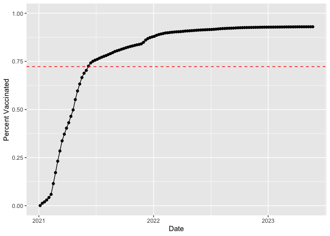

Class 17: Mini-project
================
Marcos Díaz-Gay
5/31/23

# Getting data

``` r
vax <- read.csv("https://marcos-diazg.github.io/BIMM143_SP23/class-material/class17/covid19vaccinesbyzipcode_test.csv")
```

Q1

``` r
colnames(vax)
```

     [1] "as_of_date"                                
     [2] "zip_code_tabulation_area"                  
     [3] "local_health_jurisdiction"                 
     [4] "county"                                    
     [5] "vaccine_equity_metric_quartile"            
     [6] "vem_source"                                
     [7] "age12_plus_population"                     
     [8] "age5_plus_population"                      
     [9] "tot_population"                            
    [10] "persons_fully_vaccinated"                  
    [11] "persons_partially_vaccinated"              
    [12] "percent_of_population_fully_vaccinated"    
    [13] "percent_of_population_partially_vaccinated"
    [14] "percent_of_population_with_1_plus_dose"    
    [15] "booster_recip_count"                       
    [16] "bivalent_dose_recip_count"                 
    [17] "eligible_recipient_count"                  
    [18] "eligible_bivalent_recipient_count"         
    [19] "redacted"                                  

Q9

``` r
library(lubridate)
```


    Attaching package: 'lubridate'

    The following objects are masked from 'package:base':

        date, intersect, setdiff, union

``` r
today() - ymd(vax$as_of_date[nrow(vax)])
```

    Time difference of 16 days

Q10

``` r
length(unique(vax$as_of_date))
```

    [1] 125

``` r
library(dplyr)
```


    Attaching package: 'dplyr'

    The following objects are masked from 'package:stats':

        filter, lag

    The following objects are masked from 'package:base':

        intersect, setdiff, setequal, union

# Focus on San Diego

``` r
sd <- vax[ vax$county == 'San Diego' , ]
```

Q11

``` r
length(unique( sd$zip_code_tabulation_area ))
```

    [1] 107

Q12

``` r
# Tidyverse
library(dplyr)
the_largest_zip_code = filter(sd, age5_plus_population == max(sd$age5_plus_population))
the_largest_zip_code$zip_code_tabulation_area
```

      [1] 92154 92154 92154 92154 92154 92154 92154 92154 92154 92154 92154 92154
     [13] 92154 92154 92154 92154 92154 92154 92154 92154 92154 92154 92154 92154
     [25] 92154 92154 92154 92154 92154 92154 92154 92154 92154 92154 92154 92154
     [37] 92154 92154 92154 92154 92154 92154 92154 92154 92154 92154 92154 92154
     [49] 92154 92154 92154 92154 92154 92154 92154 92154 92154 92154 92154 92154
     [61] 92154 92154 92154 92154 92154 92154 92154 92154 92154 92154 92154 92154
     [73] 92154 92154 92154 92154 92154 92154 92154 92154 92154 92154 92154 92154
     [85] 92154 92154 92154 92154 92154 92154 92154 92154 92154 92154 92154 92154
     [97] 92154 92154 92154 92154 92154 92154 92154 92154 92154 92154 92154 92154
    [109] 92154 92154 92154 92154 92154 92154 92154 92154 92154 92154 92154 92154
    [121] 92154 92154 92154 92154 92154

``` r
# Base R
the_largest_zip_code = sd[sd$age5_plus_population == max(sd$age5_plus_population),]
unique(the_largest_zip_code$zip_code_tabulation_area)
```

    [1] 92154

Q13

``` r
sd_may23 <- filter(sd, as_of_date == '2023-05-23')
mean(sd_may23$percent_of_population_fully_vaccinated, na.rm = T)
```

    [1] 0.7419654

``` r
sd_may23 <- filter(vax, county == 'San Diego' &
                       as_of_date == '2023-05-23')
hist(sd_may23$percent_of_population_fully_vaccinated,
     xlab = 'Percentage of Population Fully Vaccinated',
     main = 'Histogram of Vaccination Rates Across\nSan Diego County - May 23, 2023')
```


ggplot2 option

``` r
library(ggplot2)
ggplot(sd_may23) +
    aes(percent_of_population_fully_vaccinated) +
    geom_histogram(bins = 12) +
    ggtitle('Histogram of Vaccination Rates Across\nSan Diego County - May 23, 2023') +
    labs(title = 'Histogram of Vaccination Rates',
         subtitle = 'Across San Diego County - May 23, 2023',
         x = 'Percentage of Population Fully Vaccinated')
```

    Warning: Removed 8 rows containing non-finite values (`stat_bin()`).


Q15

Filter UCSD zip code

``` r
ucsd <- filter(sd, zip_code_tabulation_area=="92037")
unique(ucsd$age5_plus_population)
```

    [1] 36144

``` r
str(ucsd$as_of_date)
```

     chr [1:125] "2021-01-05" "2021-01-12" "2021-01-19" "2021-01-26" ...

``` r
p <- ggplot(ucsd) +
  aes(x = ymd(as_of_date),
      y = percent_of_population_fully_vaccinated) +
  geom_point() +
  geom_line(group=1) +
  ylim(c(0,1)) +
  labs(x = 'Date', y="Percent Vaccinated")
```

Q16

``` r
vax.36 <- filter(vax, age5_plus_population > 36144 &
                as_of_date == "2023-05-23")
mean.vax.36 <- mean(vax.36$percent_of_population_fully_vaccinated)
```

``` r
p + geom_hline(yintercept = mean.vax.36,
               col = 'red',
               linetype = 'dashed')
```



Q17

``` r
summary(vax.36$percent_of_population_fully_vaccinated)
```

       Min. 1st Qu.  Median    Mean 3rd Qu.    Max. 
     0.3816  0.6469  0.7207  0.7226  0.7924  1.0000 

Q18

``` r
ggplot(vax.36) +
    aes(percent_of_population_fully_vaccinated) +
    geom_histogram() +
    xlim(c(0,1))
```

    `stat_bin()` using `bins = 30`. Pick better value with `binwidth`.

    Warning: Removed 2 rows containing missing values (`geom_bar()`).


Q20

``` r
vax.36.all <- filter(vax, age5_plus_population > 36144)

ggplot(vax.36.all) +
  aes(x = ymd(as_of_date),
      y = percent_of_population_fully_vaccinated,
      group = zip_code_tabulation_area) +
  geom_line(alpha=0.2, color='green') +
  ylim(c(0,1)) +
  geom_hline(yintercept = mean.vax.36, linetype='dashed')
```

    Warning: Removed 185 rows containing missing values (`geom_line()`).


