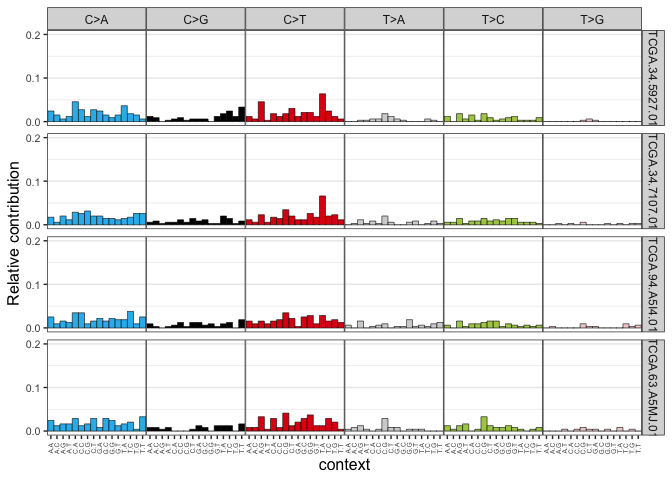
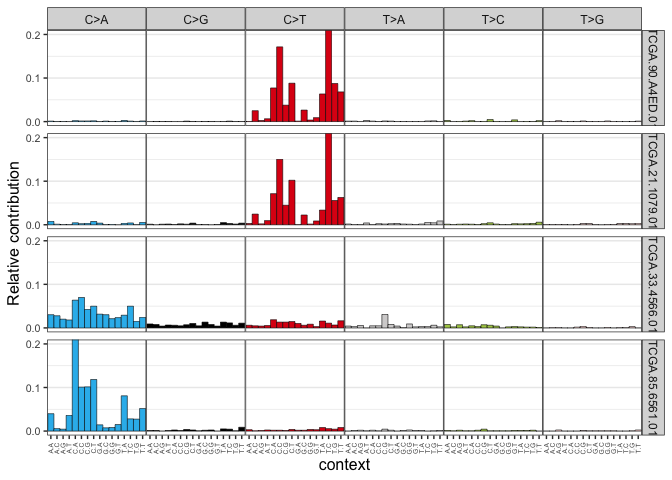

Class 18: Mini-project
================
Marcos Díaz-Gay
6/2/23

``` r
library(maftools)
coad = read.maf('data_mutations.txt')
```

    -Reading
    -Validating
    --Removed 13486 duplicated variants
    -Silent variants: 112857 
    -Summarizing
    --Possible FLAGS among top ten genes:
      TTN
      MUC16
      SYNE1
      OBSCN
    -Processing clinical data
    --Missing clinical data
    -Finished in 19.2s elapsed (15.3s cpu) 

Load the matrix

``` r
mm_coad = read.delim('lung.txt')
```

Plot the SBS96 profile

``` r
library(MutationalPatterns)
```

    Loading required package: GenomicRanges

    Loading required package: stats4

    Loading required package: BiocGenerics


    Attaching package: 'BiocGenerics'

    The following objects are masked from 'package:stats':

        IQR, mad, sd, var, xtabs

    The following objects are masked from 'package:base':

        anyDuplicated, aperm, append, as.data.frame, basename, cbind,
        colnames, dirname, do.call, duplicated, eval, evalq, Filter, Find,
        get, grep, grepl, intersect, is.unsorted, lapply, Map, mapply,
        match, mget, order, paste, pmax, pmax.int, pmin, pmin.int,
        Position, rank, rbind, Reduce, rownames, sapply, setdiff, sort,
        table, tapply, union, unique, unsplit, which.max, which.min

    Loading required package: S4Vectors


    Attaching package: 'S4Vectors'

    The following objects are masked from 'package:base':

        expand.grid, I, unname

    Loading required package: IRanges

    Loading required package: GenomeInfoDb

    Loading required package: NMF

    Loading required package: registry

    Loading required package: rngtools

    Loading required package: cluster

    NMF - BioConductor layer [OK] | Shared memory capabilities [NO: bigmemory] | Cores 2/2

      To enable shared memory capabilities, try: install.extras('
    NMF
    ')


    Attaching package: 'NMF'

    The following object is masked from 'package:S4Vectors':

        nrun

``` r
set.seed(11111) # fixing the seed for random number generation

samples_to_plot = sample(1:ncol(mm_coad),
                         size = 4) # selecting 4 random samples
plot_96_profile(mm_coad[,samples_to_plot],
                condensed = T)
```



Plots the samples with more mutations

``` r
mutations_in_samples <- colSums(mm_coad)
top_4_mutated_cases <- order(mutations_in_samples, decreasing = T)[1:4]
plot_96_profile(mm_coad[,top_4_mutated_cases],
                condensed = T)
```



Signature Assignment

``` r
library(MutationalPatterns)
cosmic_signatures = get_known_signatures(source = 'COSMIC_v3.2')

fit_res = fit_to_signatures(mm_coad, cosmic_signatures)
contributions = fit_res$contribution
```

Top 4 contributing signatures

``` r
top_signatures = sort(rowMeans(contributions), decreasing = T)
top_signatures
```

            SBS4        SBS24        SBS39        SBS13        SBS87         SBS2 
    1.049223e+02 3.021590e+01 2.981430e+01 2.659960e+01 1.967180e+01 1.824299e+01 
           SBS26        SBS38        SBS7b        SBS15        SBS7a         SBS1 
    1.302875e+01 1.289818e+01 1.238551e+01 1.115180e+01 1.025563e+01 7.111862e+00 
           SBS29        SBS30        SBS20        SBS19       SBS10b        SBS22 
    7.026467e+00 6.609097e+00 6.009767e+00 5.856720e+00 5.720324e+00 4.969161e+00 
            SBS6        SBS86        SBS25        SBS91        SBS33        SBS89 
    4.165966e+00 4.149268e+00 4.140327e+00 3.702224e+00 3.332720e+00 3.324327e+00 
           SBS18        SBS12         SBS3       SBS17a        SBS94        SBS31 
    2.399986e+00 2.324280e+00 2.303532e+00 2.270031e+00 2.012053e+00 1.963233e+00 
           SBS16        SBS21        SBS42        SBS92         SBS5        SBS23 
    1.830040e+00 1.558530e+00 1.550215e+00 1.528212e+00 1.285401e+00 1.248445e+00 
           SBS35        SBS32         SBS8        SBS7d       SBS10a        SBS14 
    1.173929e+00 1.036702e+00 1.000298e+00 8.182248e-01 8.156251e-01 6.749551e-01 
          SBS17b        SBS44        SBS7c        SBS84        SBS11        SBS36 
    6.482908e-01 5.159678e-01 4.705560e-01 4.663016e-01 4.364654e-01 3.460383e-01 
          SBS10d        SBS34        SBS28        SBS88        SBS90        SBS85 
    2.332712e-01 2.131866e-01 1.797550e-01 1.739406e-01 6.304647e-02 5.891286e-02 
           SBS93        SBS37        SBS40        SBS41         SBS9       SBS10c 
    4.034188e-02 3.358749e-02 2.424181e-02 1.699646e-02 1.568680e-02 9.554316e-04 

To get relative values for mutations in signatures

``` r
relative_contributions = apply(contributions, 2,
                               prop.table)
top_relative = sort(rowMeans(relative_contributions),
                    decreasing = T)
top_relative
```

            SBS4        SBS24        SBS39        SBS13        SBS87         SBS2 
    2.361533e-01 8.534249e-02 8.064435e-02 6.469107e-02 5.367677e-02 4.602372e-02 
           SBS26        SBS15        SBS38         SBS1        SBS7a        SBS29 
    3.780209e-02 2.717412e-02 2.539863e-02 2.434540e-02 2.328959e-02 2.175429e-02 
           SBS30        SBS19        SBS7b       SBS10b        SBS22         SBS6 
    1.825820e-02 1.796973e-02 1.620577e-02 1.524861e-02 1.432992e-02 1.346036e-02 
           SBS86        SBS20        SBS89        SBS91        SBS25        SBS33 
    1.318132e-02 1.268975e-02 1.145210e-02 1.125421e-02 1.113359e-02 1.015471e-02 
            SBS3       SBS17a        SBS12        SBS16        SBS94        SBS18 
    7.619714e-03 7.454695e-03 7.131446e-03 7.010301e-03 6.874586e-03 6.832289e-03 
           SBS31        SBS42        SBS21        SBS92         SBS5         SBS8 
    6.219582e-03 5.575090e-03 5.375698e-03 5.170187e-03 4.946256e-03 4.503869e-03 
           SBS32        SBS23        SBS7d        SBS35       SBS10a       SBS17b 
    3.759592e-03 3.550723e-03 3.276355e-03 3.207592e-03 3.198972e-03 2.350775e-03 
           SBS14        SBS44        SBS84        SBS11        SBS7c        SBS36 
    2.179343e-03 2.148256e-03 2.023290e-03 1.487599e-03 1.281360e-03 1.231428e-03 
           SBS34        SBS88        SBS28       SBS10d        SBS90        SBS85 
    8.853731e-04 6.675165e-04 6.185473e-04 5.562101e-04 2.877130e-04 2.268260e-04 
           SBS93        SBS37         SBS9        SBS40        SBS41       SBS10c 
    2.034224e-04 1.678530e-04 1.275002e-04 1.080338e-04 1.034204e-04 4.525502e-06 
